# Báo cáo nghiên cứu portfolio — giai đoạn 1

Ngày xem: 4 tháng 10 năm 2026. Công cụ: Playwright 1.63, Chromium headless, viewport desktop 1440×900 và mobile 390×844.

**Kết luận ngắn:** những trang khiến mình tin người làm trong vài chục giây gần như đứng yên. Chuyển động đáng nhớ thường là một chi tiết nhỏ (gạch menu, thẻ sáng khi hover, một dòng chữ đổi). Các trang 3D, màn hình chờ, con trỏ tùy chỉnh và hạt nền chuyển động che mất nội dung — không hợp khách Upwork.

Mình đề xuất **6 hiệu ứng** cho bản đầu. Danh sách chọn nằm ở cuối file.

## Cách chọn trang

Nguồn: [emmabostian/developer-portfolios](https://github.com/emmabostian/developer-portfolios), README ghi 2005 portfolio. Đã clone `--depth 1` vào `research/developer-portfolios`.

Bắt buộc theo prompt: Brittany Chiang, Delba, Lee Robinson, Adham Dannaway, Bruno Simon, Francisco Salido (`paco.fyi`). Link Lee trong repo là `leerob.io`; trang đang sống và mình đã mở là [leerob.com](https://leerob.com/).

Phần còn lại: lọc vai trò Full Stack, Frontend hoặc Software Engineer, ưu tiên domain riêng hoặc `vercel.app` (bỏ `github.io`, Netlify, Framer, Firebase…). Pool còn 679 trang. Lấy 18 trang bằng mẫu ngẫu nhiên có seed `20261004`, cộng 6 trang bắt buộc = **24 trang**.

Hai trang tải được nhưng screenshot desktop bị timeout lúc chờ font: [rajs.app](https://rajs.app/) và [aquarifolio.vercel.app](https://aquarifolio.vercel.app/). Vẫn giữ trong bảng vì có ảnh mobile và dữ liệu DOM. Không trang nào bị bỏ vì không mở được.

Ảnh nằm trong `research/screenshots/<slug>/`. Dưới mỗi mục là ảnh desktop; ảnh mobile cùng thư mục, file `mobile.png`.

## Các trang đã xem

### Bắt buộc

**[Brittany Chiang](https://brittanychiang.com/)** — frontend engineer. Nền `rgb(15, 23, 42)`, chữ `rgb(148, 163, 184)`, font Inter (Next font). Desktop hai cột: trái cố định (tên, chức danh, một câu, menu About / Experience / Projects có gạch ngang ở mục đầu trang, icon mạng xã hội); phải cuộn. Kinh nghiệm là hàng phẳng: ngày, vai trò, mô tả, pill công nghệ màu teal. Cuối trang, hàng project đang hover có nền khối tối hơn và tiêu đề teal. Footer ghi Next.js, Tailwind, Vercel, Inter. Có link “skip to content”. Mobile xếp một cột, icon xã hội lên dưới câu giới thiệu, không còn sidebar. Gần như không có animation lúc tải (`getAnimations()` = 0).

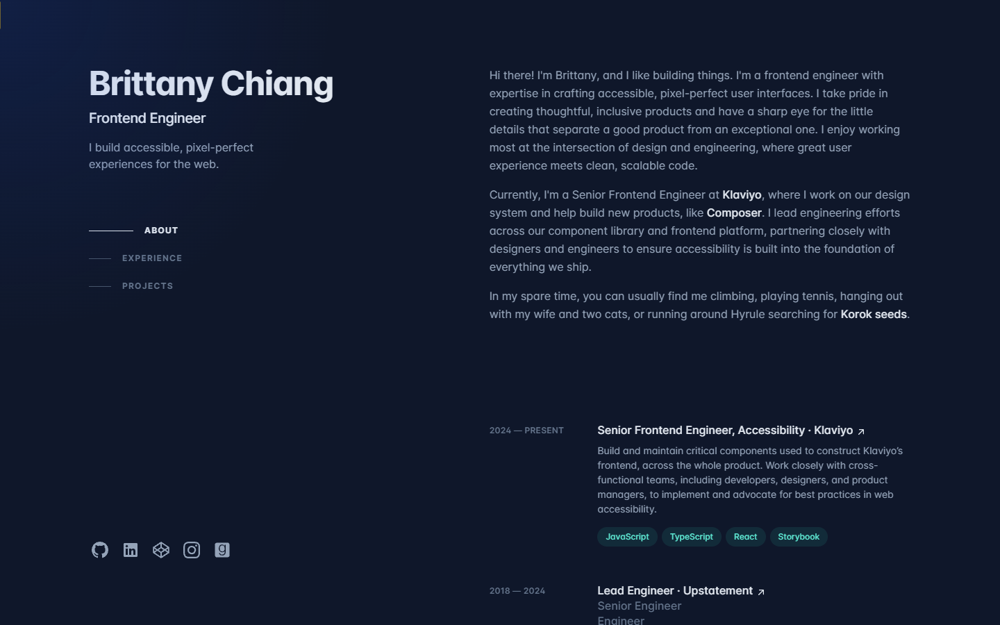

**[Delba](https://delba.dev/)** — portfolio xin việc dạng bài viết. Nền gần trắng, font serif Fraunces, không canvas, không animation. Trái là lời mời làm việc và danh sách việc đã làm (link trong câu, không phải thẻ). Phải là đoạn About, ảnh tròn, link LinkedIn / YouTube / GitHub / X. Nút “Let's talk”. Mobile xếp About xuống dưới. Đây là cực “ít hiệu ứng, nhiều việc đã làm”.

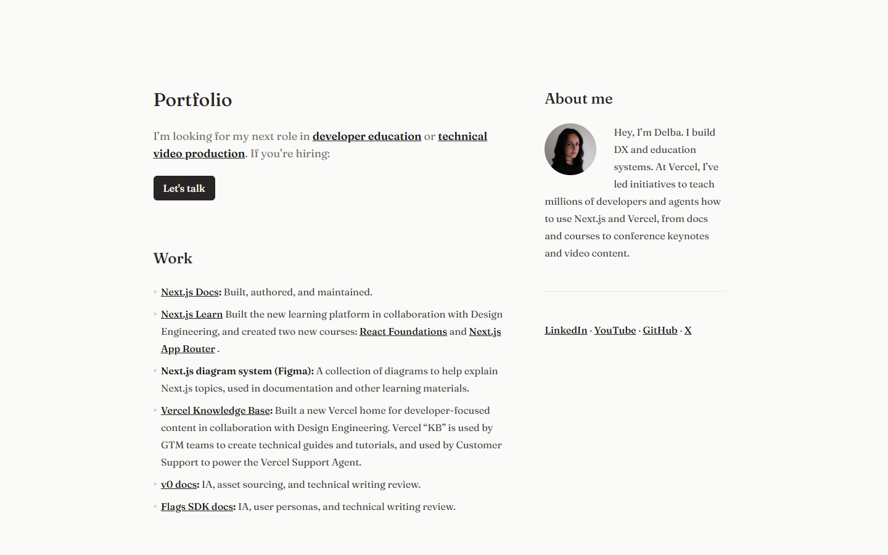

**[Lee Robinson](https://leerob.com/)** — trang cá nhân / blog. Nền trắng, chữ gần đen, tiêu đề serif (Iowan Old Style), nội dung sans. Trái là bio có nút Default / Long, danh sách Notes và bài viết. Phải là minh họa lớn; mobile bỏ minh họa. Lúc tải có 107 animation trong DOM nhưng không có canvas, và khung hình trông tĩnh. Mình không kết luận đó là Three.js: từ “three” xuất hiện trong HTML là tín hiệu quá yếu.

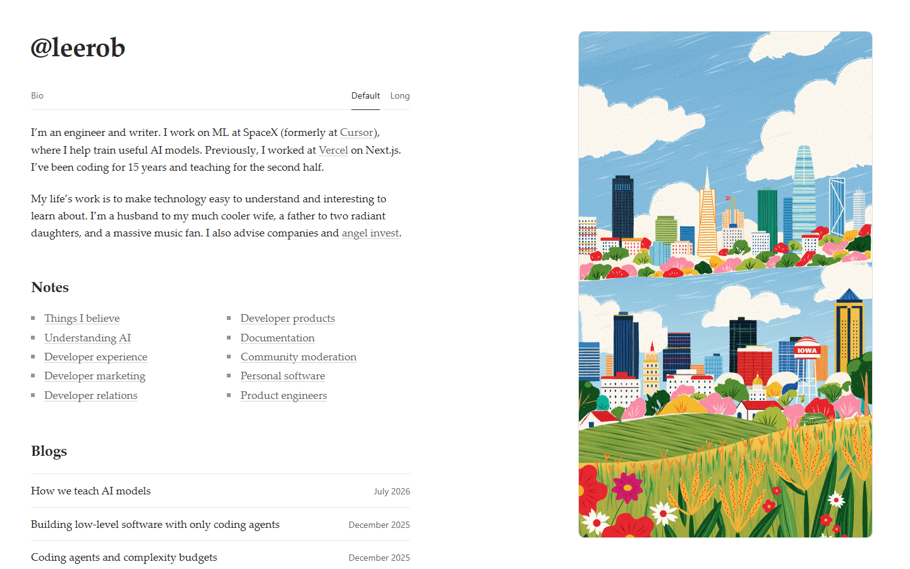

**[Adham Dannaway](https://www.adhamdannaway.com/)** — một chân dung cắt dọc: nửa minh họa, nửa ảnh, nhãn “designer” và “&lt;coder&gt;”. Font Proxima Nova, thanh nav đen. Di chuột sang phải thì hai nhãn và đoạn mô tả hiện ra. Đường cắt vẫn ở giữa trong cả hai lần di chuột, nên mình không khẳng định đường cắt bám theo con trỏ. Ảnh mobile headless gần như trắng, không dùng được. Đây là nhận diện riêng của trang này, không phải mẫu bố cục để sao.

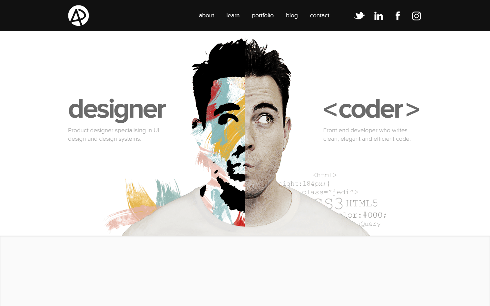

**[Bruno Simon](https://bruno-simon.com/)** — một canvas, HTML có Three.js, font Nunito và Amatic SC. Sau vài giây khung hình headless vẫn là một mảng tím đen, không đọc được scene. Mình không mô tả lối chơi hay camera vì không nhìn thấy. Trang này không dùng làm mẫu bố cục.

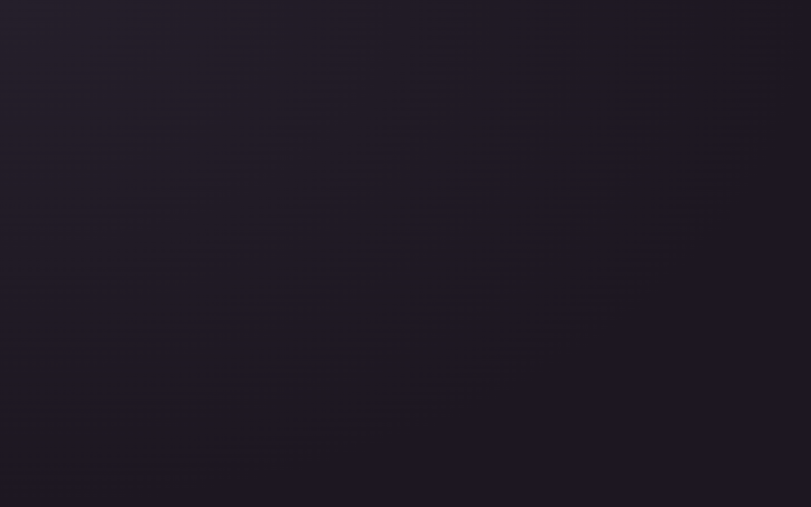

**[Francisco Salido — paco.fyi](https://paco.fyi/)** — kỹ sư full-stack. Nền trắng, serif Crimson Pro cho câu hero, monospace cho dòng `paco@home:~$` (một animation, gần như chắc là con trỏ nhấp nháy). Bố cục ô: hero, ảnh pixel, timeline kinh nghiệm, ảnh dashboard sản phẩm có chấm carousel, khối liên hệ, guestbook vẽ tay, footer `whoami`. Mobile: nút menu, chữ trên, ảnh dưới. Ít chuyển động, nhiều bằng chứng việc đã làm.

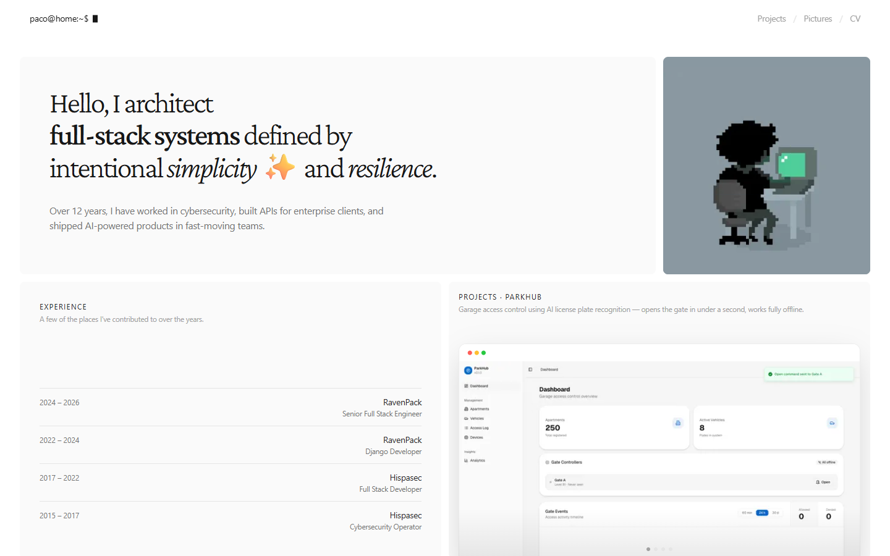

### Mẫu ngẫu nhiên

**[Dauren Abasov](https://dadashi44.vercel.app/en)** — frontend. Nền đen, Inter + Bebas Neue, HTML có GSAP và một video. Màn đầu là bộ đếm tới 100 và câu “こんにちは”, rồi trang cuộn theo từng màn (mục “01 APPROACH” chỉ còn một dòng ở đáy). Có RU/EN. Intro chặn nội dung.

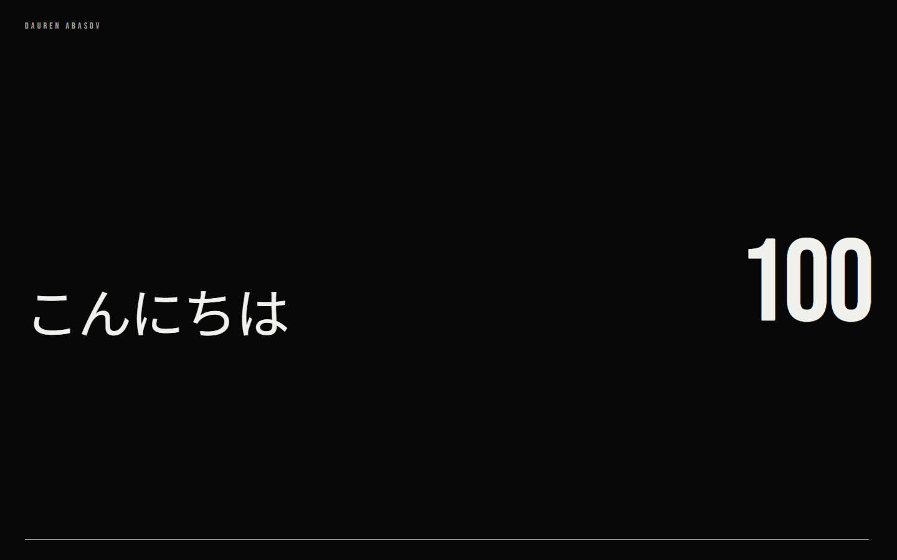

**[Masab Qurban](https://www.masabqurban.com/)** — full-stack. Nền kem, Syne + Inter, `cursor: none`, 2 canvas, 9 animation. Ảnh chân dung đè lên tên khổ lớn. Số liệu đang đếm dở (thấy “0+”). Cuộn xuống gặp mép xé giữa hero sáng và khối đen. Đẹp, nhưng con trỏ riêng và mặt nạ lúc cuộn là trang trí.

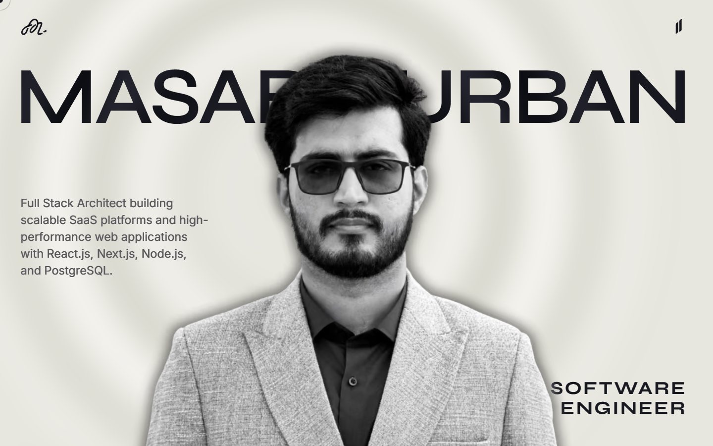

**[Tibor Ignéczi](https://igneczitibor.hu/)** — full-stack. HTML có GSAP, Three.js và Barba. Nav có About / Projects / Blog, nút Ctrl K, nút HU, nút theme. Sau gần 3 giây vẫn là thẻ giữa màn và dòng “LOADING INTERACTIVE SCENE… 00%”. Scene 3D không kịp hiện.

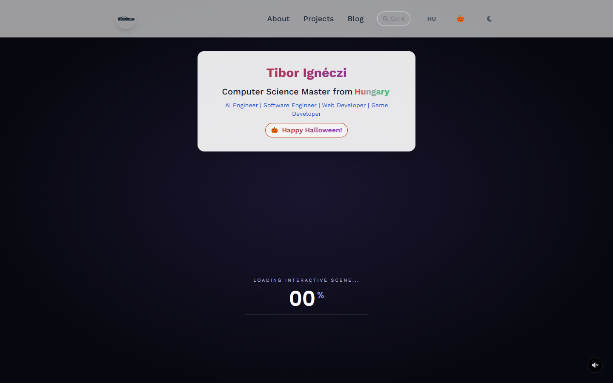

**[Priyanshu Ghosh](https://priyanshu-ghosh-seven.vercel.app/)** — full-stack. Nền xanh đen, JetBrains Mono, 1 canvas, 22 animation. Toàn màn là log BIOS giả, có nút Skip intro. Không thấy portfolio phía sau trong khung hình đầu.

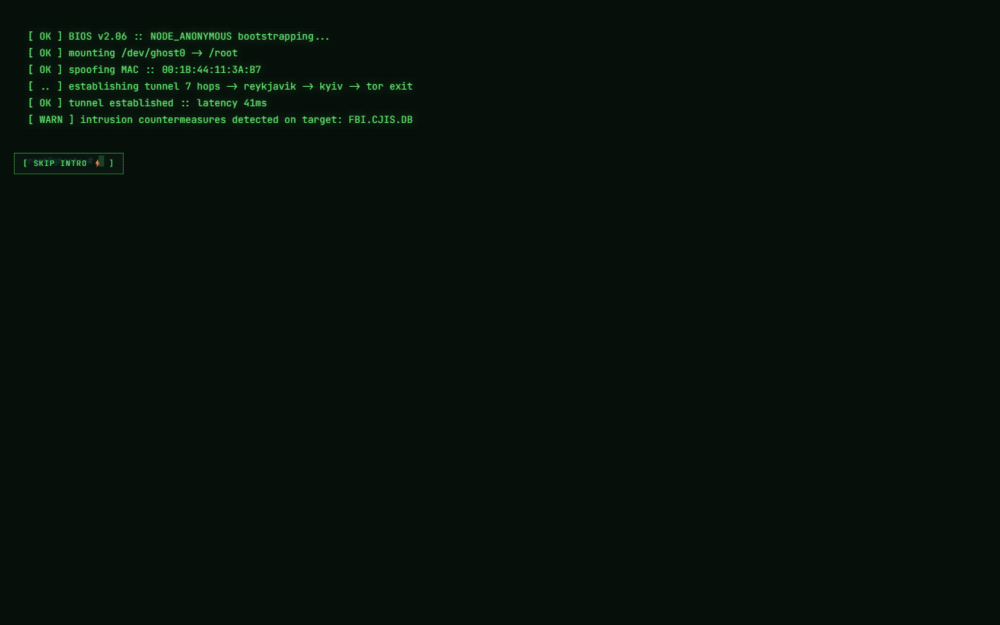

**[Naveen Kumar](https://www.naveenweb.site/)** — MERN. Font Outfit, 2 canvas, **263 animation**. Nền hạt sáng và vòng phát sáng che một phần hero. Header dạng viên thuốc, nút theme, nút Uplink. Banner cookie đè nội dung. Nặng và rối so với mục tiêu 30 giây.

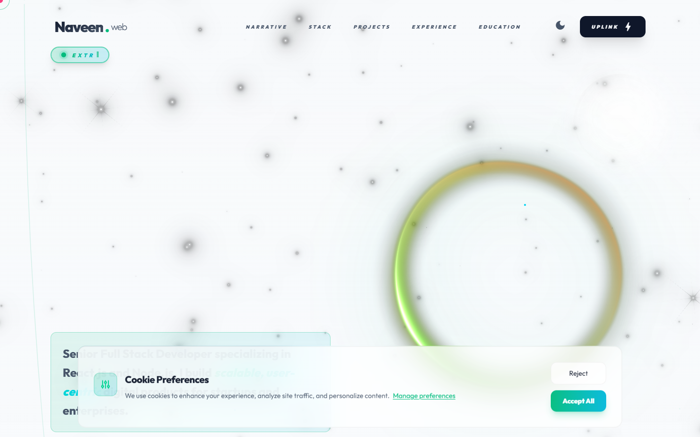

**[Rajesh Pal](https://rajs.app/)** — full-stack. Desktop timeout khi chụp. Mobile là pill “LOADING 52%” đè chữ chạy ngang. DOM: nền gần đen, font Geist, 2 canvas, HTML có ScrollTrigger và Three.js. Không dùng làm mẫu.

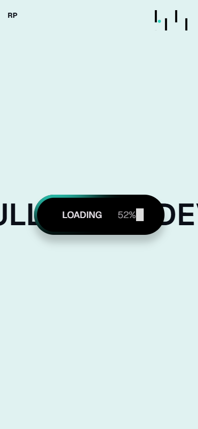

**[Nikhila Koneru](https://nikhilakoneru.com/)** — full-stack. Nền sáng, tên gradient xanh–tím, dòng chức danh có caret: “Full-Stack Dev|”. 1 canvas, 31 animation. Nút View Projects / Get In Touch, icon xã hội dọc, nút theme. Rõ việc cần làm, typewriter dễ đọc.

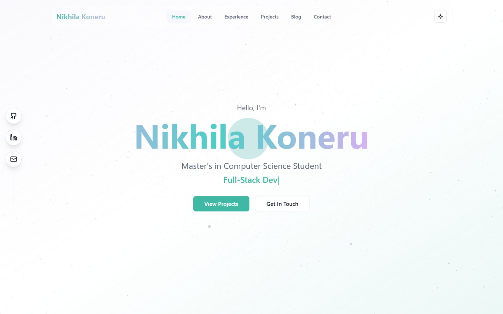

**[Maciej Pulikowski](https://pulik.dev/)** — software engineer. Nền gần đen, nav icon dạng viên thuốc, ảnh tròn, đoạn About có thành tích cụ thể, rồi danh sách blog. 0 canvas, 0 animation. Tin cậy đến từ câu chữ, không đến từ chuyển động.

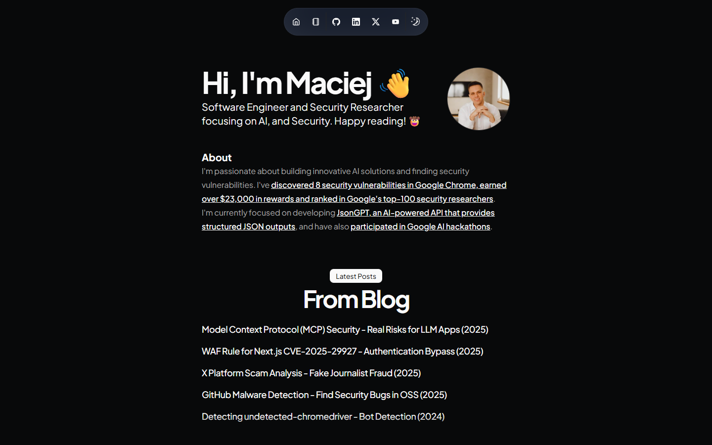

**[Luke Liukonen](https://liukonen.dev/)** — senior software engineer. Cùng họ bố cục với Brittany: cột trái cố định, menu có gạch, cột phải là đoạn giới thiệu và 4 thẻ. Nền `rgb(15, 16, 18)`, nhấn vàng, IBM Plex Sans + Cascadia Code. Mobile: sidebar lên đầu, nút menu `[ = ]`. Một animation. Dễ đọc, hợp khách công ty.

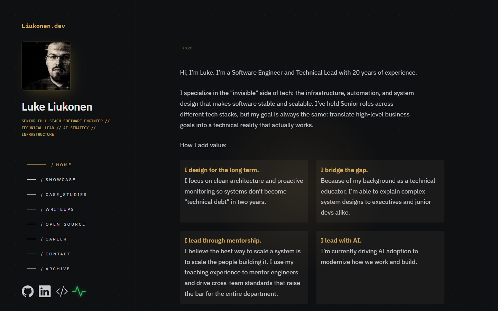

**[Lamine Neggazi](https://lamine.cc/)** — full-stack. Màn đầu là lưới mờ, tên khổng lồ và một chấm đen (trang đặt `cursor: none`, 2 canvas). Cuộn tiếp mới thấy câu chức danh, ảnh, nav viên thuốc, số 2 / 2K+ / 4+, nút theme. Lưới đẹp; con trỏ riêng và màn tên toàn trang làm chậm việc đọc.

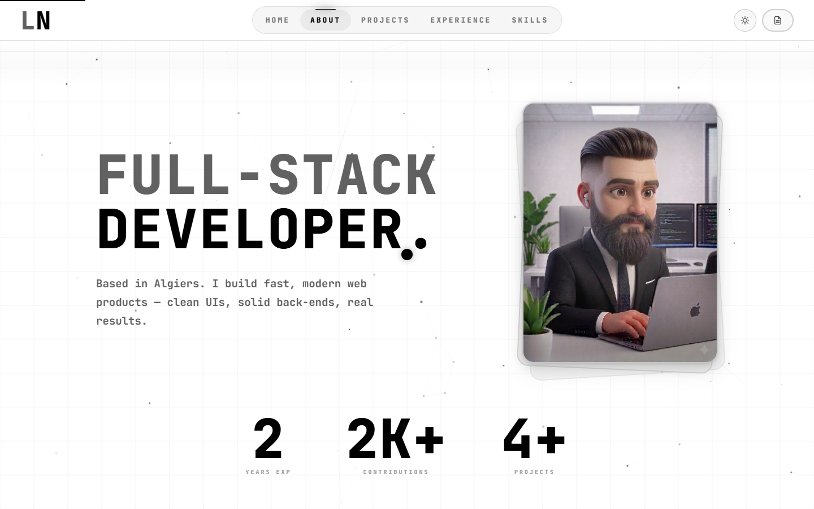

**[Philippe Fanaro](https://aquarifolio.vercel.app/)** — full-stack. Desktop timeout. Mobile là bể kính với khối 3D (hình atom, đa diện). 1 canvas, HTML có chuỗi “three”. Ấn tượng thị giác, không thấy case study trong khung hình.

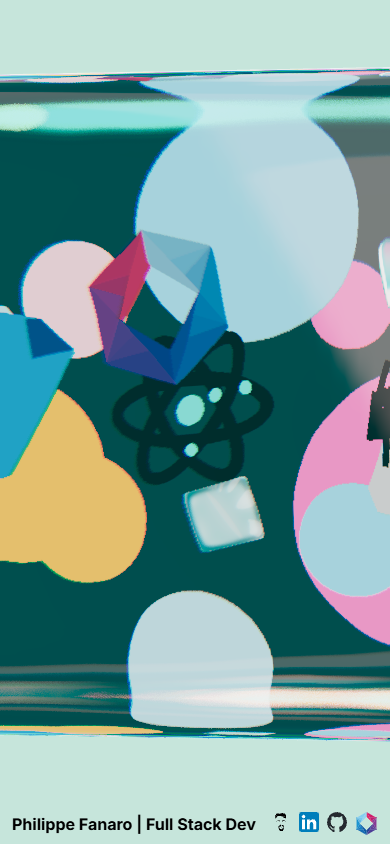

**[Paritosh Khubchandani](https://paritosh-dev.vercel.app/)** — full-stack, freelance. Nền xanh than có lưới, Inter + Sora, HTML có Framer. Badge “Open to Freelance” với chấm xanh, headline có caret “Startup MVPs|”, nút Hire Me, dãy logo công nghệ, bốn số. Nav có How I Work và nút theme. Mobile: nút menu, hai nút chính full chiều ngang. Gần với mục tiêu Upwork nhất trong mẫu ngẫu nhiên.

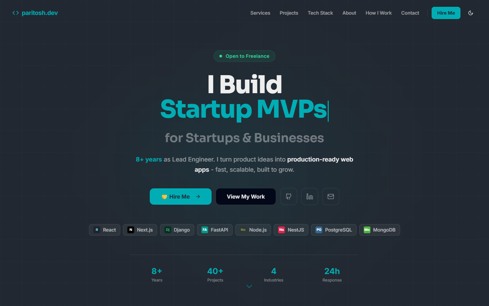

**[Lai Huishan — shan-verse.com](https://shan-verse.com/)** — full-stack. Nền đen, sao nhỏ, chữ serif, nhấn vàng. Khối “current status”, số views, bản đồ tín hiệu theo tháng, nút EN / 中 / 日. 1 canvas, 0 animation lúc chụp. Nhiều trang trí, ít “việc tôi làm cho khách” ở màn đầu.

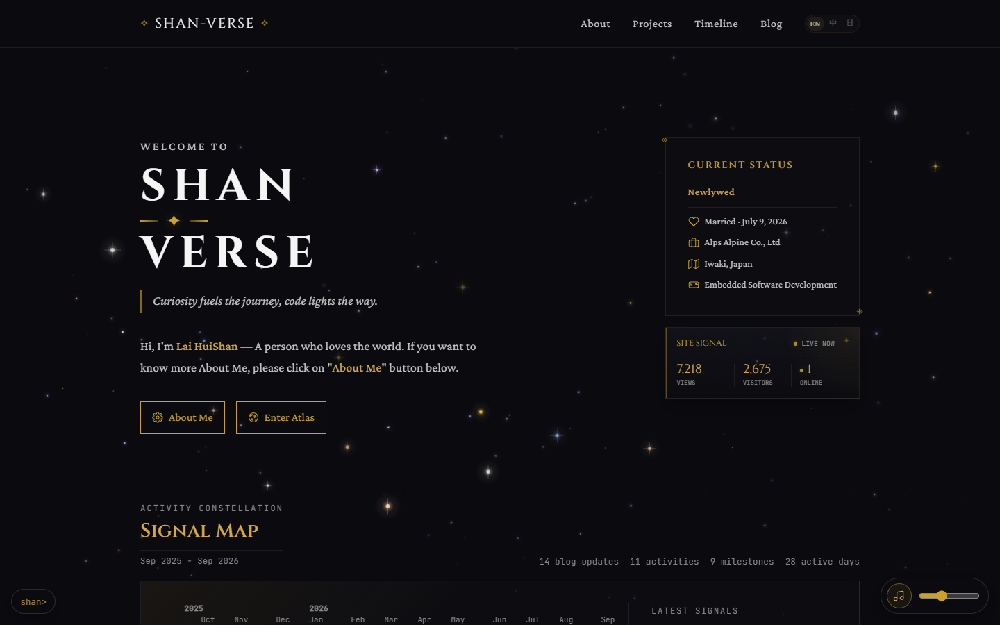

**[Cristopher Coronado](https://cristopher-coronado-portfolio.vercel.app/)** — full-stack. Nền trắng, tên gradient tím–hồng, pill “open to new opportunities”, ảnh tròn, ba thẻ số, chip công nghệ, nút theme. Năm animation, không canvas. Sạch và quen thuộc; các con số trên trang này là của anh ấy, không lấy sang.

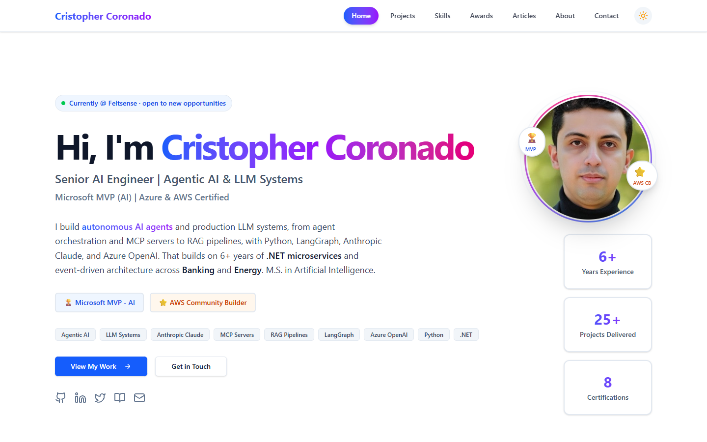

**[Ilija Korodic](https://ilijakorodic.com/)** — frontend. Nền navy, mạng lưới chấm (3 canvas), `cursor: none`, tên xanh nhạt, font Montserrat, badge Available, ảnh chân dung, marquee công nghệ chạy ngang. Mobile vẫn giữ lưới và xếp ảnh xuống dưới, có nút menu. Marquee chạy liên tục dễ gây mệt.

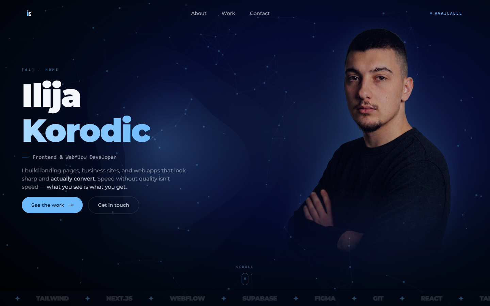

**[Mohammad Sharif](https://sharifrahat.com/)** — full-stack. Nền sáng có lưới mờ, tên teal, chức danh đang gõ dở (“Senior Software Engine” trên mobile, còn caret trên desktop). Ảnh có viền phát sáng, pill “Available for opportunities”, nav viên thuốc, nút theme. 19 animation, không canvas. Rõ và vừa sức.

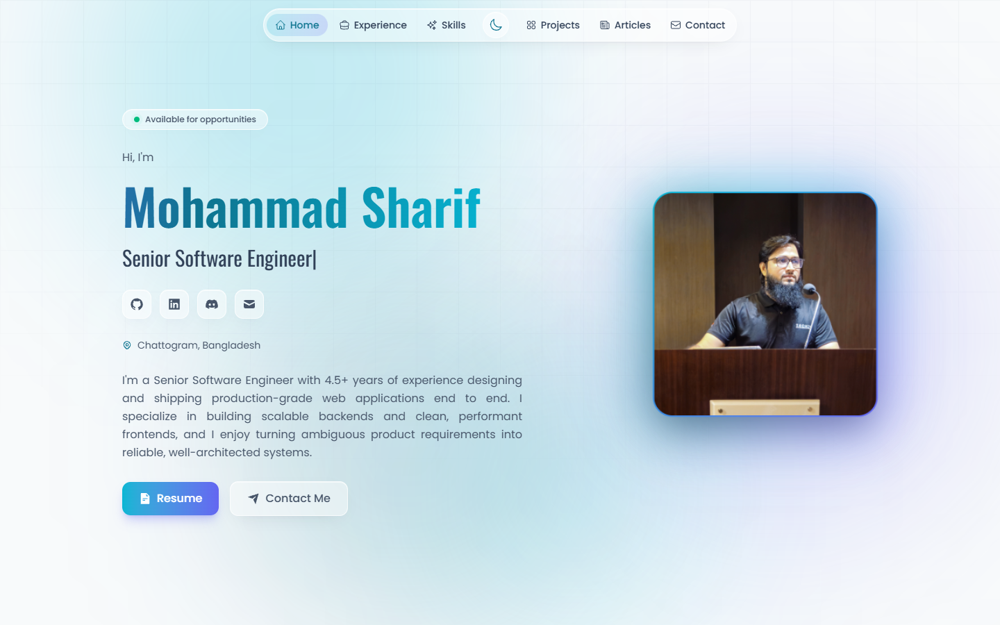

**[Ashutosh Dash](https://ashutoshdash.in/)** — frontend. Desktop bị một lớp tím nhạt và banner analytics che gần hết. Mobile thấy hero chữ, nút resume, menu. Bốn animation. Ít bài học về chuyển động.

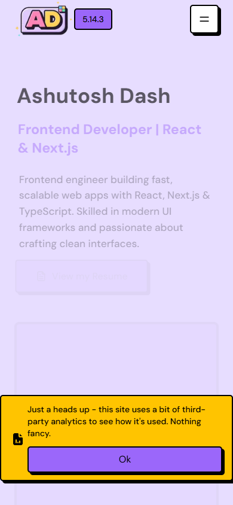

**[Sairithik Komuravelly](https://heysai.dev/)** — full-stack. Khung hình dừng ở “CALIBRATING 100%” và một vạch sáng. HTML có Spline; font Geist, JetBrains Mono, IBM Plex Sans Condensed. Chữ portfolio nằm trong DOM nhưng bị màn chờ che. Chín animation.

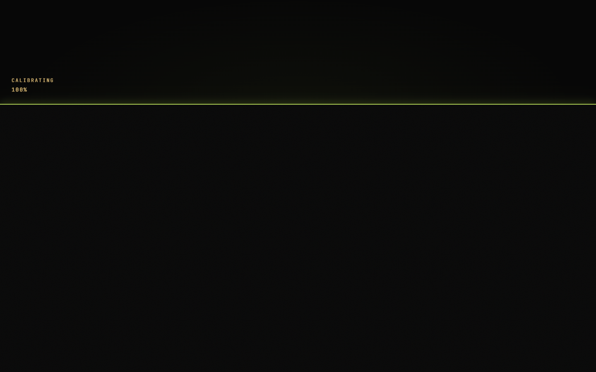

## Hiệu ứng và tương tác đáng ghi

| # | Hiệu ứng | Thấy ở đâu | Khó | Hiệu năng | Khách doanh nghiệp |
|---|---|---|---|---|---|
| 1 | Cột trái cố định, gạch ngang đánh dấu mục đang xem | Brittany, Luke | Dễ. `position: sticky` + IntersectionObserver | Rất thấp | Có. Người xem nhảy đúng chỗ trong 30 giây |
| 2 | Hàng project/kinh nghiệm đổi nền và màu chữ khi hover | Brittany, ảnh `projects.png` | Dễ. CSS | Thấp. Đổi màu nền khi hover, không chạy mỗi frame | Có. Cho biết hàng đó bấm được |
| 3 | Caret gõ chức danh hoặc một cụm ở headline | Paritosh, Sharif, Nikhila | Dễ. Một chuỗi, một timer | Thấp nếu một dòng, tắt khi `prefers-reduced-motion` | Có, nếu gõ một lần hoặc đổi 3 cụm rồi dừng. Gõ lặp vô hạn làm người ta chờ |
| 4 | Badge “đang nhận việc” với chấm xanh nhịp nhẹ | Paritosh, Sharif, Ilija, Cristopher | Dễ. CSS opacity | Rất thấp | Có. Đúng tín hiệu freelance |
| 5 | Lưới hoặc chấm nền gần như tĩnh | Paritosh, Sharif, Lamine | Dễ nếu là CSS. Khó và nặng nếu là canvas | CSS: thấp. Canvas hạt của Naveen: 263 animation, cao | CSS tĩnh thì có. Hạt chuyển động thì không |
| 6 | Số đếm tăng | Masab (đang ở 0+ lúc chụp), các số đã nằm yên ở Paritosh, Lamine, Cristopher | Dễ | Thấp | Chỉ khi số là thật. Trang này chưa có metric để đếm |
| 7 | Băng chữ công nghệ chạy ngang | Ilija | Dễ. CSS transform | Thấp nhưng chạy mãi, phải tắt khi reduced-motion | Yếu. Chip đứng yên dễ quét hơn |
| 8 | Con trỏ tùy chỉnh (`cursor: none`, chấm theo chuột) | Masab, Lamine, Ilija | Vừa. Phải tắt trên cảm ứng | Vừa, dễ lệch hit target | Không. Mất con trỏ hệ thống, hại accessibility |
| 9 | Màn chờ: đếm %, BIOS giả, “calibrating”, “loading scene” | Dauren, Tibor, Priyanshu, Rajesh, Sairithik | Vừa | Cao theo nghĩa chặn nội dung, không phải theo CPU | Không. Ngược mục tiêu 30 giây |
| 10 | Scene 3D / WebGL | Bruno (canvas + Three.js, không vẽ được trong headless), Philippe, Tibor, Rajesh; Sairithik có Spline | Khó. Phải lazy-load, và bạn cần đồng ý thư viện | Cao. Dễ tụt Lighthouse | Không với hồ sơ booking, e-commerce, plugin |
| 11 | Hero cắt đôi designer / coder | Adham | Vừa, và là nhận diện riêng của trang đó | Thấp (ảnh CSS) | Không sao chép. Một người, một vai full-stack, không phải thương hiệu hai nửa |
| 12 | Mép xé / mặt nạ khi cuộn giữa hai khối màu | Masab | Vừa | Vừa nếu gắn vào scroll | Không cần. Đẹp nhưng không giúp quyết định thuê |
| 13 | Command palette (Ctrl K) | Tibor, nút hiện trên nav | Vừa | Thấp nếu mở mới tải | Để sau. Khách Upwork ít khi biết phím tắt |
| 14 | Ô nội dung: ảnh UI thật, timeline, liên hệ, carousel chấm | Paco | Dễ với ảnh tĩnh. Carousel là tương tác nhỏ | Thấp | Có. Đây là thứ tạo tin tưởng mạnh nhất trong cả mẫu |
| 15 | Đổi theme sáng/tối | Paritosh, Sharif, Naveen, Cristopher, Lamine, Tibor | Dễ | Thấp | Có. Đã nằm trong yêu cầu thiết kế, không tính vào ngân sách chuyển động |

Không thấy trong mẫu này, dù prompt gợi ý: nút “magnetic”, spotlight gradient bám chuột, text scramble, thanh tiến trình đọc trang. Mình không đề xuất những thứ chưa nhìn thấy chỉ vì chúng phổ biến trên bài viết.

Repo mở của Brittany mà mình thấy trên GitHub là bản Gatsby cũ (`bchiang7/v4`). Trang đang sống ghi Next.js + Tailwind + Inter. Mình chỉ quan sát UI, không lấy code, chữ hay ảnh.

## Đề xuất cho portfolio của bạn

Sáu mục dưới đây dùng CSS và hook nhỏ. Không cần Framer Motion, GSAP, Three.js hay Spline. Tất cả tắt hoặc hiện trạng thái cuối khi `prefers-reduced-motion`. Không hiệu ứng theo chuột trên cảm ứng.

1. **Menu cột trái có gạch mục đang xem** — từ Brittany và Luke. Đúng bố cục bạn đã chọn. Trên mobile, phần đó lên đầu trang và menu gọn, như Luke và Brittany.
2. **Hàng kinh nghiệm và project sáng khi hover** — từ hàng project của Brittany. Nền nhích sáng, tiêu đề chuyển màu nhấn, tag giữ nguyên. Chỉ `background-color`, `color`, `opacity`.
3. **Badge “Available for freelance” với chấm nhịp chậm** — từ Paritosh, Sharif, Ilija. Một vòng opacity, khoảng 2 giây.
4. **Một dòng hero đổi ba cụm, rồi dừng** — từ caret của Paritosh / Sharif / Nikhila, nhưng không gõ lặp. Ba cụm lấy từ tagline của bạn: booking, e-commerce, plugins cho monday và Atlassian. Crossfade bằng opacity. Reduced-motion thì hiện đủ câu tagline ngay.
5. **Ảnh dự án trong khung UI, hover nhích lên** — từ ô dashboard của Paco. `transform` vài pixel. Ảnh placeholder cho đến khi bạn có screenshot. Không carousel tự chạy.
6. **Lưới CSS rất nhạt, đứng yên** — từ Paritosh và Sharif. Không canvas, không hạt.

Số đếm chỉ nên thêm sau khi bạn có số thật. “2+ năm” một mình không đáng một animation.

Những thứ mình cố ý không đưa vào bản đầu: scene 3D, màn chờ, con trỏ riêng, marquee, command palette, hero cắt mặt, mép xé lúc cuộn, nền hạt.

## Cần bạn chọn trước khi sang giai đoạn 2

Trả lời bằng số, ví dụ `1 2 3 4 5` hoặc `tất cả`.

Mình chưa khởi tạo Next.js và chưa thêm thư viện. Bước tiếp theo, sau khi bạn chốt, là đề xuất cấu trúc thư mục và danh sách component, rồi dừng lại chờ bạn duyệt.
